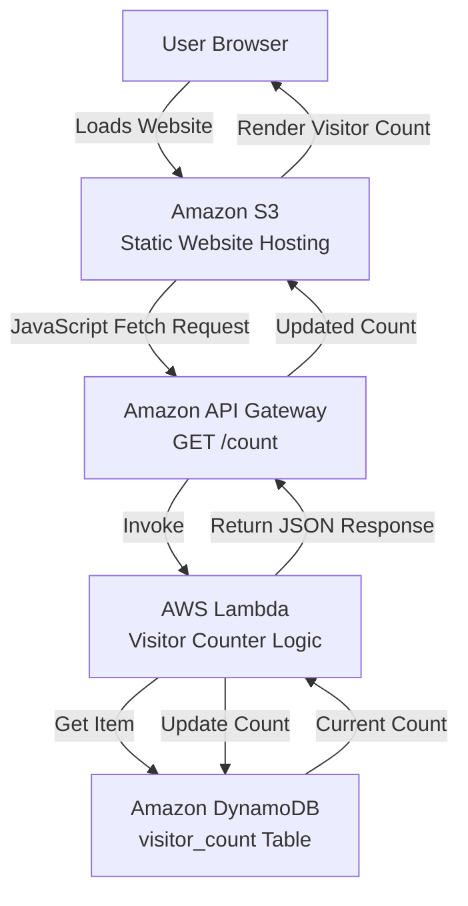
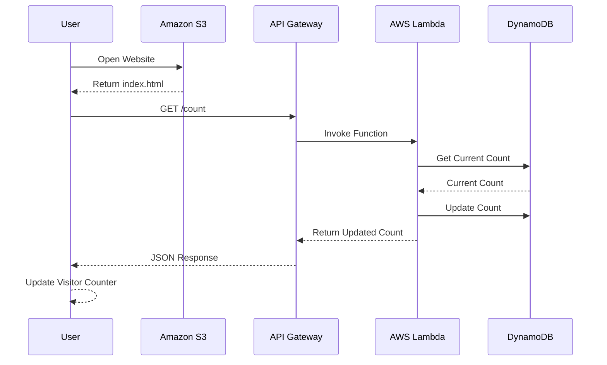
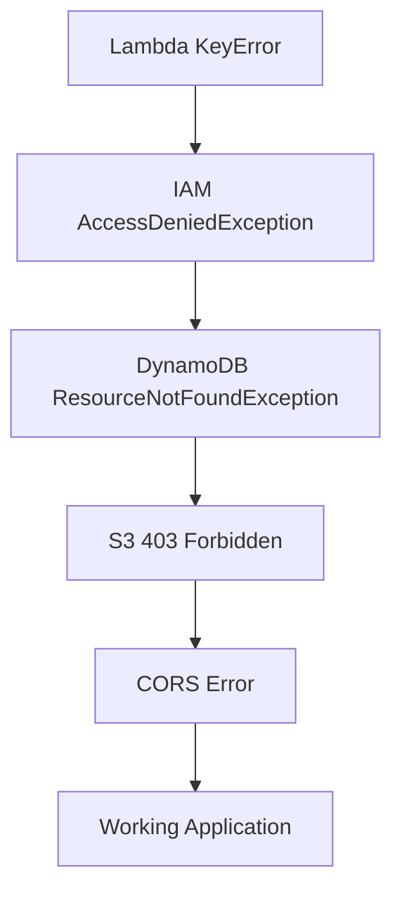

# Serverless Visitor Counter on AWS

A simple serverless web application built to learn AWS core services through a real end-to-end project.

The application displays a visitor count on a webpage hosted in Amazon S3. Each page visit triggers an API Gateway endpoint, which invokes a Lambda function that updates a counter stored in DynamoDB.

---

# Architecture Diagram



---

# Request Flow



---

# AWS Services Used

| Service     | Purpose                |
| ----------- | ---------------------- |
| Amazon S3   | Static website hosting |
| API Gateway | Public HTTP endpoint   |
| AWS Lambda  | Business logic         |
| DynamoDB    | Persistent storage     |
| IAM         | Access management      |
| CloudWatch  | Logging and debugging  |

---

# Project Structure

```text
visitor-counter/
│
├── index.html
├── lambda/
│   └── lambda_function.py
│
└── README.md
```

---

# DynamoDB Schema

## Table

```text
visitor_count
```

## Partition Key

```text
id (String)
```

## Sample Item

```json
{
  "id": "homepage",
  "count": 1
}
```

---

# API Endpoint

## Request

```http
GET /count
```

## Sample Response

```json
{
  "currentCount": 12,
  "updatedCount": 13
}
```

---

# How It Works

1. User opens the website hosted on Amazon S3.
2. JavaScript executes when the page loads.
3. Frontend sends a GET request to API Gateway.
4. API Gateway invokes the Lambda function.
5. Lambda reads the current count from DynamoDB.
6. Lambda increments and updates the count.
7. Updated value is returned to the frontend.
8. Browser displays the latest visitor count.

---

# Key Concepts Learned

## Serverless Architecture

Built an application without managing servers using AWS managed services.

## Stateless Compute

Learned that Lambda should not store application state. Persistent state belongs in DynamoDB.

## IAM Permissions

Understood how AWS authorization works through IAM Roles and Policies.

Key permissions required:

```text
dynamodb:GetItem
dynamodb:UpdateItem
```

## API Gateway

Learned how HTTP requests are translated into Lambda invocations.

## DynamoDB

Worked with NoSQL storage and item-based access patterns.

## S3 Static Website Hosting

Hosted a frontend application without EC2 or traditional web servers.

## CORS

Configured API Gateway CORS settings to allow browser-based requests from an S3-hosted frontend.

## CloudWatch

Used logs to debug and troubleshoot AWS service integrations.

---

# Challenges Encountered

## KeyError in Lambda

### Issue

Lambda expected an event field that was not present.

### Resolution

Inspected the incoming event payload and adjusted the request handling logic.

---

## AccessDeniedException

### Issue

Lambda could not access DynamoDB.

### Resolution

Updated IAM permissions to allow DynamoDB read and write operations.

---

## ResourceNotFoundException

### Issue

Incorrect DynamoDB table name.

### Resolution

Corrected the table reference.

---

## S3 403 Forbidden

### Issue

Static website could not be accessed publicly.

### Resolution

Configured bucket policy and public object access.

---

## CORS Errors

### Issue

Browser blocked requests from the S3 website to API Gateway.

### Resolution

Enabled and configured CORS in API Gateway.

---

# Troubleshooting Journey



---

# Production Improvements

The current implementation is intentionally simple for learning purposes.

Potential enhancements:

* Amazon CloudFront CDN
* Custom Domain with Route 53
* HTTPS with ACM
* Infrastructure as Code using Terraform
* CI/CD using GitHub Actions
* CloudWatch Metrics and Alarms
* AWS X-Ray Tracing
* DynamoDB Atomic Counters
* Authentication using Amazon Cognito

---

# Lessons Learned

The biggest learning from this project was not writing code but understanding how AWS services interact.

Key takeaways:

* State should live in a database, not Lambda memory.
* IAM permissions are often the root cause of cloud issues.
* API Gateway acts as the bridge between HTTP clients and Lambda.
* S3 can serve static websites without servers.
* Browsers enforce CORS, and APIs must explicitly allow cross-origin requests.
* Cloud debugging requires isolating problems layer by layer.

---

# Skills Demonstrated

* AWS Lambda
* Amazon API Gateway
* Amazon DynamoDB
* Amazon S3
* IAM Roles and Policies
* CloudWatch
* CORS Configuration
* Serverless Architecture
* REST APIs
* AWS Troubleshooting
* Frontend and Backend Integration

---

# Why I Did

Built as a hands-on AWS learning project to understand core cloud services, serverless architecture, and end-to-end application deployment.
