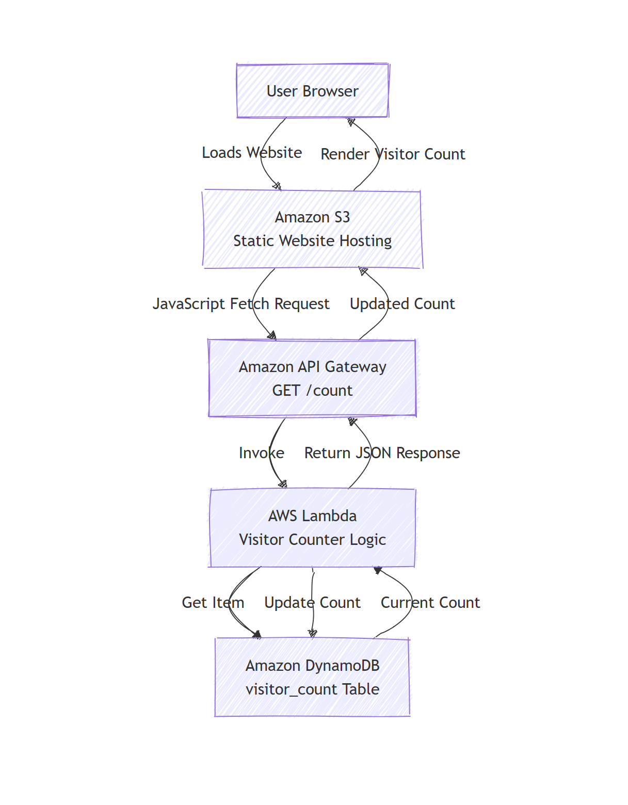
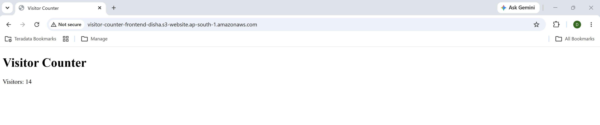
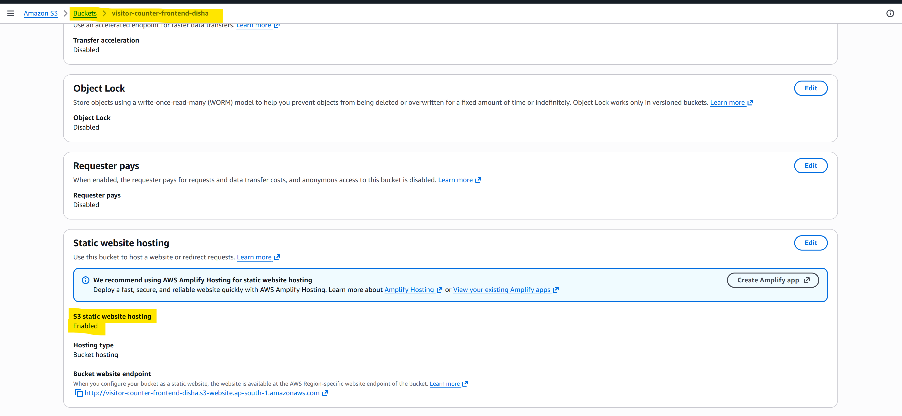
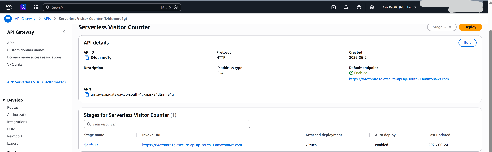
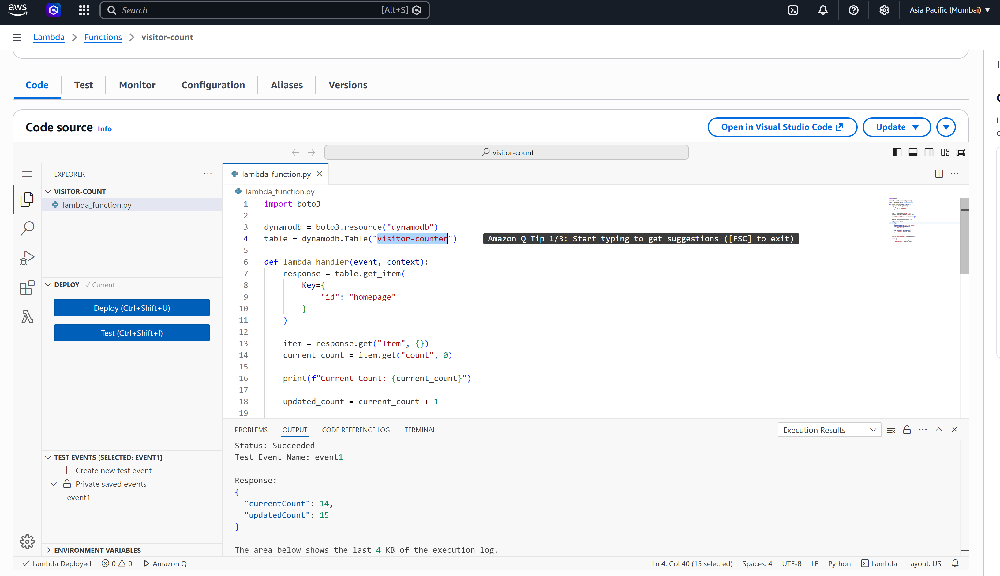
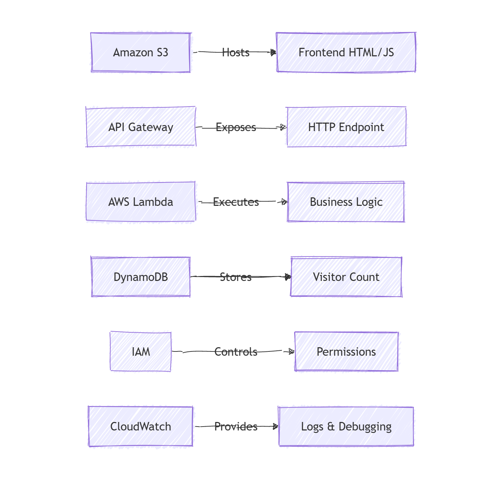

## 📑 Table of Contents

1. [Project Overview](#-project-overview)
2. [Why I Built This Project](#-why-i-built-this-project)
3. [Architecture](#-architecture)
4. [Application Flow](#-application-flow)
5. [AWS Services Used](#️-aws-services-used)
6. [Project Structure](#-project-structure)
7. [Getting Started](#-how-to-run-this-project)
8. [Screenshots](#️-website)
9. [Challenges & Troubleshooting](#️-challenges-faced--troubleshooting)
10. [Key Learnings](#-key-learnings)
11. [Future Enhancements](#-future-enhancements)
12. [Interview Questions](#-interview-questions)
13. [Skills Demonstrated](#-skills-demonstrated)


# 🚀 Serverless Visitor Counter on AWS

A simple serverless web application built using AWS core services to understand how modern cloud-native applications are designed, deployed, secured, and debugged.

The project demonstrates how a static website can interact with a serverless backend to maintain and display a visitor counter without managing any servers.

---

# 📌 Project Overview

The application displays the total number of visitors to a webpage.

Every time a user opens the website:

1. The frontend is loaded from Amazon S3.
2. JavaScript sends an HTTP request to API Gateway.
3. API Gateway invokes an AWS Lambda function.
4. Lambda retrieves the current visitor count from DynamoDB.
5. Lambda increments the counter.
6. The updated value is stored back into DynamoDB.
7. The updated visitor count is returned to the frontend.
8. The webpage displays the latest visitor count.

---

# 🎯 Why I Built This Project

Built as a hands-on learning project to gain practical experience with AWS Serverless Architecture and understand how multiple AWS services integrate to build scalable cloud-native applications.

My learning goals were to understand:

- Serverless Computing
- REST APIs
- IAM Permissions
- Static Website Hosting
- DynamoDB
- AWS Networking
- Browser Security (CORS)
- Cloud Troubleshooting

This project helped me understand how cloud services communicate and how to debug real-world integration issues.

---

# 🏗️ Architecture



---

# 🔄 Application Flow

```text
User
   │
   ▼
Amazon S3
(Static Website)

   │

JavaScript Fetch()

   │
   ▼

API Gateway

   │
   ▼

AWS Lambda

   │
   ▼

Amazon DynamoDB
```

---

# ⚙️ AWS Services Used

| AWS Service | Purpose |
|-------------|---------|
| Amazon S3 | Static Website Hosting |
| API Gateway | HTTP Endpoint |
| AWS Lambda | Business Logic |
| DynamoDB | Persistent Storage |
| IAM | Authorization |
| CloudWatch | Logging & Debugging |

---

# 📂 Project Structure

```
visitor-counter/
│
├── assets/
│   ├── api-gateway.png
│   ├── architecture-diagram.png
│   ├── lambda.png
│   ├── s3-hosting.png
│   ├── service_responsibilities.png
│   └── website.png
│
├── lambda/
│   └── lambda.py
│
├── index.html
└── README.md
```

---

# How to Run This Project

## Step 1

Create a DynamoDB table.

```
Table Name:
visitor_count

Partition Key:
id (String)
```

Add an item:

```json
{
  "id": "homepage",
  "count": 0
}
```

---

## Step 2

Create an AWS Lambda function.

- Runtime: Python
- Add the Lambda code from `lambda/lambda.py`
- Attach an IAM role with DynamoDB read/write permissions.

---

## Step 3

Create an HTTP API using API Gateway.

- Create a GET route (`/count`)
- Integrate it with the Lambda function
- Enable CORS
- Deploy the API

---

## Step 4

Update the API URL inside `index.html`.

Replace:

```javascript
const apiUrl = "YOUR_API_GATEWAY_URL";
```

with your deployed API endpoint.

---

## Step 5

Create an Amazon S3 bucket.

- Enable Static Website Hosting
- Upload `index.html`
- Configure bucket policy for public read access

---

## Step 6

Open the S3 Website URL.

Every refresh should increase the visitor count.

---

# 🖥️ Website



The frontend is a simple HTML page hosted using Amazon S3 Static Website Hosting.

When the page loads, JavaScript calls the backend API and dynamically displays the latest visitor count.

---

# 🌐 Static Website Hosting



Amazon S3 is configured for Static Website Hosting.

Instead of running a traditional web server like Apache or Nginx, S3 directly serves static files such as:

- HTML
- CSS
- JavaScript

---

# 🚪 API Gateway



API Gateway exposes a public HTTP endpoint.

Responsibilities:

- Receives HTTP requests
- Invokes Lambda
- Returns JSON response
- Handles CORS

---

# ⚡ AWS Lambda



Lambda contains the application's business logic.

Responsibilities:

- Read visitor count from DynamoDB
- Increment visitor count
- Update DynamoDB
- Return updated count

---

# 🧠 Service Responsibilities



Each AWS service has a single responsibility.

| Service | Responsibility |
|----------|---------------|
| S3 | Host frontend |
| API Gateway | HTTP interface |
| Lambda | Business Logic |
| DynamoDB | Store application state |

This separation of responsibilities is one of the biggest advantages of serverless architecture.

---

# 🛠️ Challenges Faced & Troubleshooting

## 1. Lambda KeyError

### Problem

Lambda expected a value inside the event payload.

```
KeyError: 'id'
```

### Root Cause

The test event did not contain the expected key.

### Resolution

Inspected the incoming event and adjusted the Lambda logic to use a fixed partition key for the visitor counter.

---

## 2. AccessDeniedException

### Problem

Lambda could not access DynamoDB.

```
AccessDeniedException
```

### Root Cause

The Lambda execution role did not have DynamoDB permissions.

### Resolution

Added the required IAM permissions:

- dynamodb:GetItem
- dynamodb:UpdateItem

---

## 3. ResourceNotFoundException

### Problem

Lambda failed to read the table.

```
ResourceNotFoundException
```

### Root Cause

Incorrect DynamoDB table name.

### Resolution

Verified the resource name and updated the table reference.

---

## 4. S3 403 Forbidden

### Problem

The website could not be accessed publicly.

### Root Cause

Missing bucket policy.

### Resolution

Configured:

- Static Website Hosting
- Public Read Bucket Policy
- Disabled Block Public Access (for learning)

---

## 5. Browser Failed to Fetch

### Problem

The frontend displayed:

```
Failed to load counter
```

### Root Cause

API Gateway CORS was not configured.

### Resolution

Enabled:

- Allowed Origins
- GET Method
- Required Headers

This allowed the browser to call the API successfully.

---

# 💡 Key Learnings

This project taught me much more than writing Lambda code.

## AWS Architecture

- Stateless Compute
- Persistent Storage
- API-driven applications

---

## IAM

Understanding that:

```
Role
+
Policy
=
Permissions
```

Every AWS request is evaluated against IAM permissions.

---

## API Gateway

Learned how HTTP requests are translated into Lambda invocations.

---

## DynamoDB

Learned:

- Primary Keys
- Item Retrieval
- Update Operations

Also understood why application state belongs in a database rather than Lambda memory.

---

## S3

Learned how to host static websites without provisioning servers.

---

## CORS

One of the biggest learnings.

Understanding:

```
Browser
↓

Cross-Origin Request

↓

API Gateway

↓

Allowed?

↓

Success / Failure
```

---

## Cloud Debugging

Used CloudWatch logs to troubleshoot:

- IAM Issues
- Lambda Errors
- DynamoDB Errors
- API Gateway Issues
- Browser Errors

---

# 🚀 Future Enhancements

This project can be improved further by implementing:

- CloudFront CDN
- Custom Domain
- HTTPS using ACM
- Route 53
- Terraform
- GitHub Actions CI/CD
- DynamoDB Atomic Counters
- Authentication using Amazon Cognito
- Monitoring with CloudWatch Alarms
- AWS X-Ray Tracing

---

# 📚 Interview Questions

## Why did you choose Lambda?

Because the application only requires execution when a request arrives.

Lambda automatically scales and removes the need to manage servers.

---

## Why DynamoDB?

The visitor count is application state.

Lambda is stateless, so persistent data must be stored in a database.

---

## Why API Gateway?

Browsers communicate over HTTP.

API Gateway exposes Lambda as a REST endpoint.

---

## Why S3 instead of EC2?

The frontend is completely static.

S3 provides:

- Lower cost
- High availability
- No server management

---

## What is CORS?

CORS is a browser security mechanism.

It controls whether JavaScript from one origin is allowed to access resources from another origin.

---

## What is the limitation of the current implementation?

The current implementation performs:

```
Read

↓

Increment

↓

Write
```

Under concurrent traffic this may result in race conditions.

Production systems should use DynamoDB Atomic Counters.

---

# 🏆 Skills Demonstrated

- AWS Lambda
- Amazon API Gateway
- Amazon DynamoDB
- Amazon S3
- IAM Roles & Policies
- CloudWatch
- Serverless Architecture
- REST APIs
- Browser CORS
- AWS Troubleshooting
- End-to-End Cloud Application Development

---
